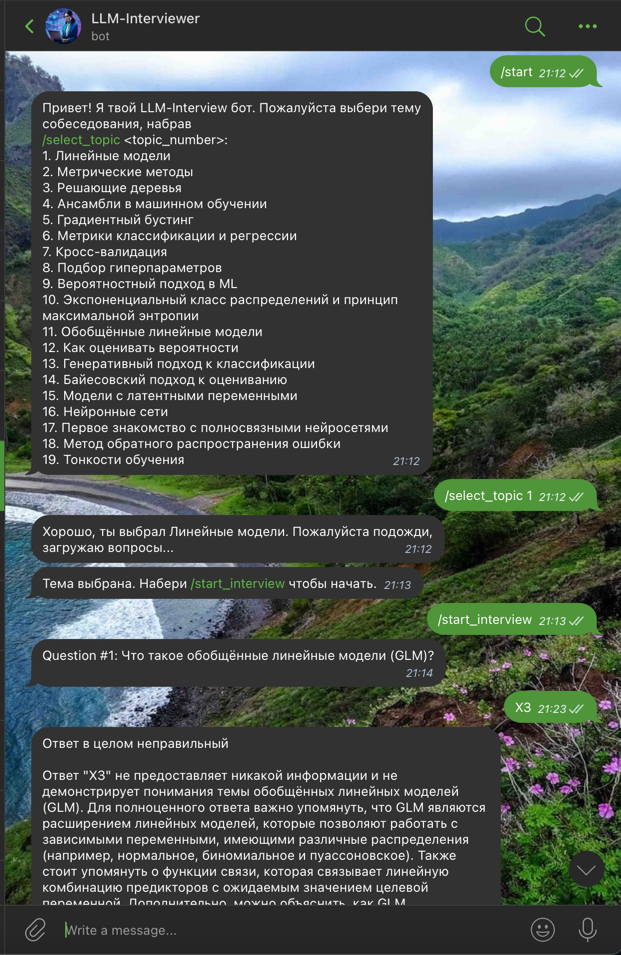
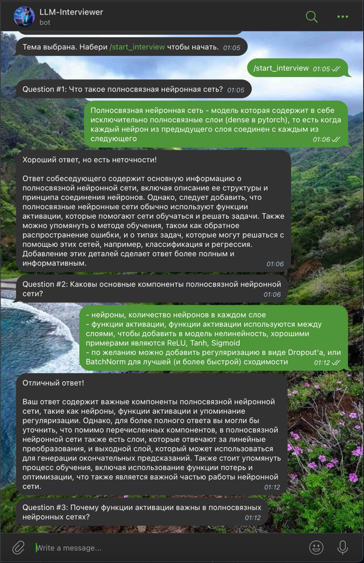

# LLM-Interviewer

## Цель проекта

Помощник собеседующий на основе LLM и RAG, который собеседует пользователя по выбранным тематикам из различных областей машинного и глубокого обучения.

При необходимости можно запрашивать подсказки, список ресурсов с содержанием вопросов и ответов (в процессе).

## Скриншоты работы

### Начало диалога + неправильный ответ



### Хороший и отличный ответы



## Параметры запуска

Работающего бота можно найти по ссылке: https://t.me/llm_interviewer_bot

Сам запуск производится вручную с установкой необходимых библиотек и запуском из консоли.

```
>>> python3 -m venv venv

>>> source venv/bin/activate

>>> pip install -r requirements.txt

>>> nohup python3 bot_new.py
```

## Статистика по данным

### Deep Learning - Ian Goodfellow

* Общее количество символов: **1768399**
* Общее количество слов: **263367**

### Yandex ML Handbook

* Общее количество символов: **640943**
* Общее количество слов: **81495**

Количество символов и слов по главам:

| Название главы         | Количество символов | Количество слов |
|------------------------|:-------------------:|:---------------:|
| prob_genclass          |        16305        |      1972       |
| ensembles              |        15443        |      2075       |
| cross_validation       |        21843        |      3057       |
| neural_nets            |        72885        |      8776       |
| matrix_diff            |        11821        |      1386       |
| model_evaluation       |        42767        |      5644       |
| intro                  |        33733        |      4637       |
| prob_maxent            |        13497        |      1494       |
| prob_bayes             |        35694        |      4135       |
| optimization           |        89547        |      11260      |
| decision_tree          |        40123        |      5294       |
| prob_calibration       |        12381        |      1499       |
| clustering             |        33116        |      4220       |
| prob_intro             |        17075        |      2122       |
| grad_boost             |        20575        |      2574       |
| hyperparameters_tuning |        32705        |      4214       |
| prob_glm               |        10117        |      1255       |
| ml_theory              |        13547        |      1799       |
| linear_models          |        74505        |      9865       |
| metric_based           |        33264        |      4217       |

### Вопросы-ответы

* Общее количество символов: **635155**
* Общее количество слов: **94046**

Количество вопросов, слов и символов по темам:

| Тема                   | Количество символов | Количество слов | Количество вопросов-ответов |
|------------------------|:-------------------:|:---------------:|:---------------------------:|
| Behaviour              |         351         |       60        |              4              |
| Classic ML             |       196607        |      30664      |             232             |
| Computer vision        |       244649        |      34472      |             110             |
| Deep Learning          |        72793        |      10608      |             43              |
| LLM                    |        65178        |      8942       |             19              |
| Probability_Statistics |        34885        |      5975       |             34              |
| Python                 |        8323         |      1284       |             12              |
| SQL_DB                 |        12369        |      2041       |             12              |

## Оценка качества работы RAG

* Оценивалось, была ли пара вопрос-ответ сгенерирована на основе найденных документов (Accuracy)
* Оценка была по 4 темам (классическое МО, глубокое обучение, вероятностные модели, метрики оценивания)
* 10 пар вопрос-ответ на каждую тему
* Оценка производилась на основе ручной разметки

|          Тема         |       Accuracy      | 
|---------------------- |:-------------------:|
|    Классическое МО    |         90%         |     
|   Глубокое обучение   |         80%         |    
|  Вероятностные модели |         90%         |       
|   Метрики оценивания  |         90%         |     

* Общая Accuracy - 86%
     
## Структура проекта

```
LLM-Interviewer/
├── bot_new.py                              # Main bot setup and initialization
├── config.yaml                             # Configuration file for bot settings
├── requirements.txt                        # Python dependencies for the bot
├── .env                                    # Environment variables for sensitive data
├── data/                                   # Directory for data-related resources
│   ├── data_31_10_2024/                    # Static questions and answers
│   └── RAG/                                # Books and documents for the RAG pipeline
├── handlers/                               # Contains handlers for bot commands and interactions
│   ├── interview.py                        # Manages interview flow (questions, answers, etc.)
│   └── start.py                            # Handles start and topic selection
├── notebooks/                              # Jupyter notebooks and related resources
│   ├── chroma_yandex_db/                   # Folder containing vector store files
│   ├── eval_rag_artifacts/                 # Artifacts for evaluating RAG
│   ├── questions_data/                     # Raw questions extracted from parsing
│   ├── evaluate_rag.ipynb                  # Notebook to evaluate RAG pipeline
│   ├── parse_for_RAG.ipynb                 # Notebook for parsing data for RAG
│   ├── parse_questions_and_answers.ipynb   # Notebook to parse static questions
│   ├── RAG_inference_example.ipynb         # Notebook demonstrating RAG inference
│   ├── README.md                           # Instructions for launching the notebooks
│   ├── requirements.txt                    # Notebook-specific Python dependencies
│   ├── resources_to_parse_questions.txt    # List of resources for question parsing
│   └── to_start.txt                        # Steps to launch the notebooks
├── utils/                                  # Utility functions and modules
│   ├── question_loader.py                  # Utility to load and manage static questions
│   ├── rag_pipeline.py                     # Implements the RAG pipeline
│   └── stages.py                           # Utilities for managing bot stages and transitions
└── README.md                               # Documentation
```

## Авторы

Евгений Тайчинов и Елизавета Талынкова
